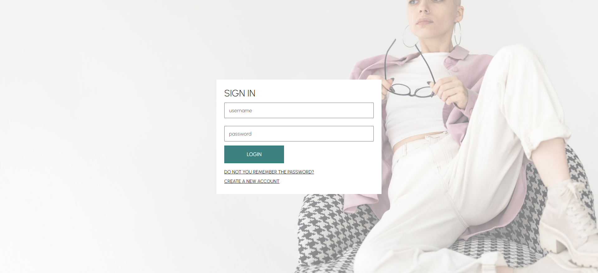
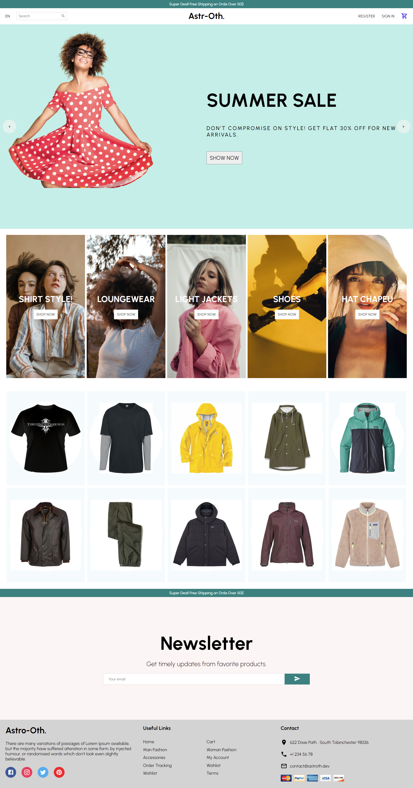

### React Node.js E-Commerce App (REDUX - Stripe - JWT ) - MERN Stack Shopping App


[](https://github.com/styled-components/styled-components)


## REST-API

To make all the http Requests, visit the **[SERVER SIDE](https://github.com/Astroth1984/ecommerce-REST-Api "Rest-API")** and follow the instructions.

## Installation

1. Clone the Repository: `git clone https://github.com/Astroth1984/e-commerce-app.git`
2. Install the required Dependencies: `npm install` or `yarn add`
3. .env file: Create Your .env file with the shown _key_:

```
  REACT_APP_STRIPE: YOUR_PUBLIC_STIPE_API_KEY 
```
4. Run Project: `npm start` or `yarn start`

## Login / Register :

To have access to the platforme, please login with the followin account : 

```
  username : admin
  password: admin123
```
Or simply Register on [localhost:3000/register](http://localhost:3000/register) and use your created account.

### Overview

## Login Page :



## Home Page : 



## Product Item : 


## Cart Page : 


### Shop Admin Panel  (Back-office): 

For Admin Dashboard, and Admin Control, Analytics and more Check-out  **[Admin-Panel](https://github.com/Astroth1984/Admin-Panel-Shop "Admin Back Office")** Repository


